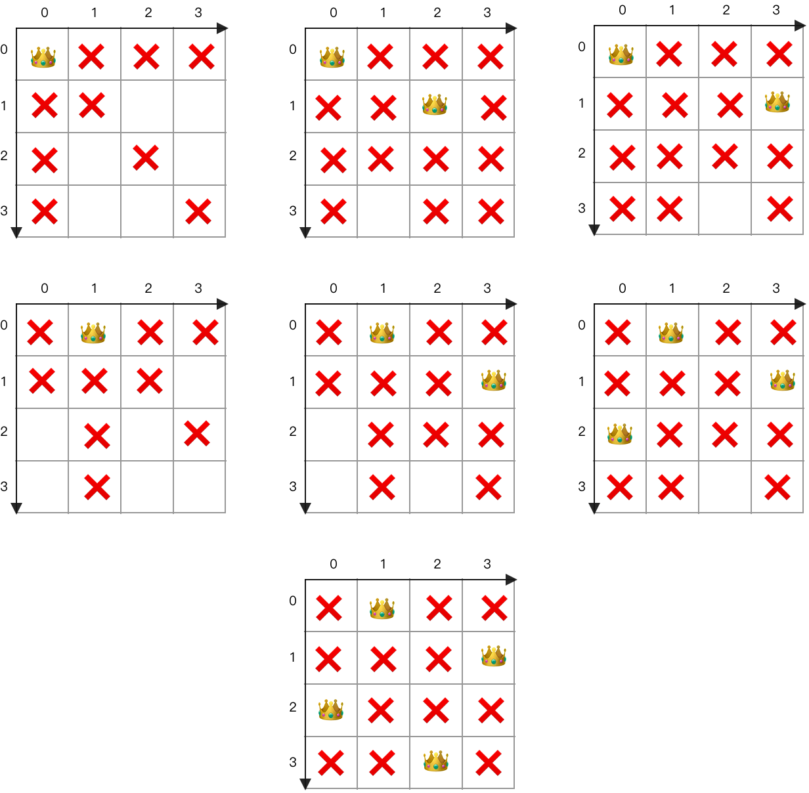

# 八皇后问题

1. 从一个空白的棋盘开始，我们尝试放置第一个皇后，因为现在棋盘是空的，所以任何位置都是可以放的，那么直接放到第一行第一列（坐标 `(0,0)` ）。
2. 这时候第一行和第一列都被占了，根据国际象棋的规则， `(1,1)` 这个位置也不能放，所以第二行只能从 `(2,1)` 开始放置。这时的棋盘如下图所示。
3. 这个时候我们发现，第三个皇后无论放在第三行的哪个位置，都会受到前两个皇后的攻击，所以这明显不是一条通路，所以回到上层发现，第二行还有一个可行的位置 `(3,1)`，那么我们把第二个皇后放在该位置尝试一下。
4. 很不幸，这个时候整个第三行也处于前两个皇后的攻击范围之内，而我们已经穷尽了第二行的所有可能性，这个时候只能回到第一行，尝试把第一个皇后放置到下一个允许的位置 `(1,0)` 上。
5. 这时第二行只有一个可以放置皇后的位置 `(3,1)` 。
6. 接下来把第三个皇后放到第三行的 `(0,2)` 。
7. 第四行还有一个可行的位置 `(2,3)` 。

到此找到了一个『四皇后』问题的可行解。转换成代码：

因为两个皇后不可能出现在同一行，所以我们一次只处理一行的情况，放置完毕后，如果此行已经是最后一行，说明我们成功找到了一个可行解，否则继续搜索下一行。当下一行搜索完毕后，把当前行的皇后挪到下一个位置并重复上述过程。

回溯思想backtrack是最关键的
至于采用哪种数据结构来表示棋盘，并记录皇后的位置。可以用二维数组表示并记录，或者一维数组下标为row 值为col，或者set等。

要全局记录的有皇后的位置、某列上有没有皇后、对角线有没有皇后。可用set、数组等存储。

- 某个位置的撇对角线上的所有位置纵横座标之和固定为某个常数
- 某个位置的捺对角线上的所有位置纵横座标之查固定为某个常数
